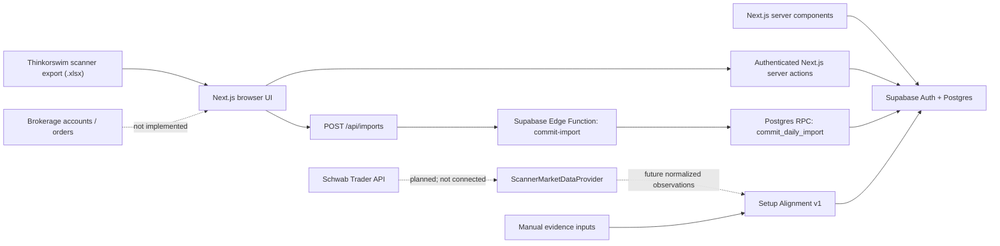

# Frontend redesign — Phase 1 audit

**Audit date:** August 3, 2026
**Repository:** `SrikarrKoli/trading-copilot`
**Branch audited:** `agent/schwab-ready-scanner-ranking` at `3cdc248`
**Status:** Complete; no application code, database schema, or brokerage state changed

## Phase objective, assumptions, and risk boundary

### Objective

Establish the product's actual capabilities, architecture, data boundaries, user journeys, and highest-priority UX, accessibility, privacy, and safety issues before changing the frontend.

### Assumptions used for this audit

- This is private, single-owner software.
- Thinkorswim remains the scanner and manual execution surface.
- Schwab Trader API credentials are pending.
- Schwab is intended to provide read-only market-data enrichment for current scanner symbols.
- Current scanner candidates are replaceable daily data. Deliberately saved watchlists, journal records, scan snapshots, and strategy snapshots persist.
- Setup Alignment is deterministic rule matching, not confidence, probability, expected return, suitability, or advice.

### Risk boundary

- No live order was placed, staged, previewed, canceled, replaced, or retried.
- No brokerage account or token exists in the audited application.
- No user data was created, edited, archived, or deleted.
- Supabase inspection was read-only.
- Screenshots avoid showing the saved watchlist symbol. The Watchlists screenshot is deliberately cropped.

## Executive result

Trading Copilot is not currently a Schwab brokerage application. It is a private scanner-research workflow composed of:

1. Thinkorswim `.xlsx` scanner import;
2. manual, versioned Setup Alignment assessment;
3. deterministic ranking of complete current-day assessments;
4. review decisions and persistent watchlists;
5. immutable saved scan snapshots;
6. a manual trading journal; and
7. a manual option expiration-payoff calculator.

There are no Schwab credentials, OAuth flow, account selectors, balances, positions, orders, live quotes, options chains, alerts, backtests, AI model calls, or execution endpoints. The frontend must not imply otherwise.

The application has a sound safety-oriented data foundation: daily scanner scope, explicit provenance, append-only decision records, server-side authentication checks, and RLS on every public table. The redesign should preserve these mechanics while consolidating the interface around the main job: **Import today's scanner → obtain current evidence → rank complete setups → decide what to save or research**.

The highest-priority findings are:

1. The core workflow is fragmented across eight equal-weight destinations.
2. The current Evidence workflow requires too much manual input to deliver the product's main value.
3. Overview can label a manual saved observation as “Live,” even though Schwab is disconnected.
4. Development auth bypass is not explicitly restricted to loopback requests.
5. There is no visible sign-out or account/session control.
6. The mobile navigation makes later destinations discoverable only by horizontal scrolling.
7. Documentation describes the product as “AI-assisted,” but no AI capability is implemented.

## Evidence inspected

- Next.js App Router source, components, server actions, route handlers, configuration, tests, and package dependencies.
- Supabase migrations, Edge Function, live schema, policies, grants, function privileges, project status, and advisors.
- All implemented UI routes in the running local application.
- Responsive layouts at 1440×1000, 768×1024, and 390×844.
- Form labels, headings, landmarks, accessible names, focus styling, reduced-motion handling, target sizes, overflow, console warnings/errors, and representative color contrast.
- Project README and architecture/product/security/Schwab documentation.

## Actual system architecture

### Frontend and application stack

| Area | Actual implementation |
| --- | --- |
| Framework | Next.js 16.2.12 App Router, React 19.2.4, TypeScript |
| Styling | Tailwind CSS 4 plus shared CSS variables and utility classes |
| Icons | Lucide React |
| Charts | Hand-rendered React/SVG; no chart library |
| Client state | Local React state, `useActionState`, and `useTransition`; no global store |
| Server data | Server components read Supabase directly; server actions and RPCs write |
| Realtime behavior | None: no WebSocket, Supabase Realtime, polling, or streaming quote feed |
| Refresh model | Data reloads on navigation or path revalidation after writes |
| Deployment | No committed Vercel project configuration or CI workflow was found |
| Automated checks | Vitest, TypeScript, ESLint, and Next production build |

### Authentication and session model

- One permanent owner is selected by `AUTH_OWNER_EMAIL`.
- Sign-in uses one-time Supabase email links and cookie-backed SSR sessions.
- The application exposes no password entry, recovery, or update flow.
- Authenticated routes validate claims and the configured owner email.
- Login responses do not reveal whether a submitted email is the owner.
- Magic-link requests cannot create a new Supabase user.
- A non-production `LOCAL_AUTH_BYPASS=true` flag bypasses owner access checks. The code does not additionally require a loopback host/request.
- A sign-out server action exists, but the UI has no sign-out control.

## Product capability truth table

| Capability | Status | Evidence / boundary |
| --- | --- | --- |
| Thinkorswim `.xlsx` import | Implemented | Reads first worksheet, column A only; 10 MB compressed and 50 MB expanded limits |
| Safe workbook parsing | Implemented | Does not execute formulas; formula-backed identifiers are quarantined |
| Symbol normalization | Implemented | Uppercases and validates ticker-like identifiers; reports blanks, duplicates, invalid rows |
| Daily scanner rollover | Implemented | Current UI is scoped to the server-derived America/Chicago date |
| Current scanner ranking | Implemented with manual evidence | Ranks only complete Setup Alignment observations; missing inputs remain unranked |
| Setup Alignment | Implemented | Ten equal 10-point rules, version `manual-high-conviction-v1.0.0` |
| Review decisions | Implemented | Append-only save, dismiss, defer, or watchlist actions |
| Watchlists | Implemented | Named lists and soft-archived items persist across scanner rollover |
| Saved scan snapshots | Implemented | Versioned scanner definitions plus immutable import snapshots |
| Manual journal | Implemented | Plans, state changes, reflections, tags, and owner-entered P/L |
| Option illustrations | Implemented manually | Long call, long put, bull call debit spread, bear put debit spread |
| Option comparison | Implemented | Up to four compatible manual illustrations on a shared expiration P/L axis |
| Live market quotes | Not implemented | No market-data request, polling, stream, quote cache, or freshness service |
| Schwab OAuth/tokens | Not implemented | No credentials, callback, token storage, refresh, or revocation code |
| Schwab market data | Contract only | Provider-independent observation interface and mapper exist; no adapter exists |
| Brokerage accounts | Not implemented | No accounts, balances, buying power, positions, or account selection |
| Orders | Not implemented | No ticket, preview, submit, cancel, replace, status, or activity flow |
| Paper/simulated trading | Not implemented | The product is manual analysis, not a simulated broker |
| Backtesting | Not implemented | Documentation is future-state only |
| Alerts | Not implemented | No rules engine, scheduler, notification service, or alert UI |
| AI analysis | Not implemented | No model dependency, API client, prompt, route, or stored generation |

### Supported instruments and environments

- Scanner imports are treated as US-equity-style ticker symbols.
- Strategy Lab supports manually entered equity-option assumptions for four debit strategies. It does not prove that Schwab options-chain access is available.
- There are no supported brokerage order types, instructions, sessions, time-in-force values, or account types because order entry does not exist.
- There is no “LIVE,” “SIMULATION,” or “READ ONLY” brokerage environment. The accurate current status is **Manual data / Schwab not connected**.
- There is one application owner and zero broker accounts.

## Route inventory

| Route | Access | Purpose | Reads | Mutations / consequential actions |
| --- | --- | --- | --- | --- |
| `/login` | Public | Permanent-owner passwordless sign-in | Supabase claims | Requests one-time email link; enumeration-safe response |
| `/auth/callback` | Public route handler | Exchange one-time-link code | Supabase Auth | Establishes owner session, then redirects to Overview |
| `/overview` | Owner | Current-day scanner summary and ranking | Imports, current stocks, evidence | None |
| `/` | Owner | Workbook import and preview | Current import state | Commits approved workbook through trusted import boundary |
| `/evidence` | Owner | Manual 10-rule evidence entry | Current candidates, saved assessments | Appends complete evidence assessment |
| `/reviews` | Owner | Filter and act on current candidates | Current candidates, latest review/evidence | Appends review decision; may assign to watchlist |
| `/scans` | Owner | Version definitions and save snapshots | Definitions, current imports, saved runs | Creates immutable definition version or scan run |
| `/watchlists` | Owner | Manage persistent saved symbols | Watchlists/items/sources | Creates list; soft-archives list/item |
| `/journal` | Owner | Create and update manual trade records | Trades, latest journal entries, sources | Creates trade identity; appends journal event |
| `/strategy-lab` | Owner | Manual option payoff analysis | Saved illustrations and optional source context | Saves immutable illustration; may create journal handoff |
| `/api/imports` | Owner | Revalidate and commit workbook | Supabase claims/session | Calls authenticated Edge Function and transactional RPC |
| `/api/health/supabase` | Public | Supabase availability check | Supabase Auth settings endpoint | None; currently returns the project reference |

There are no dynamic symbol, account, position, order, or execution-detail routes.

## Supabase data and API map

### Live project posture

- Project status: `ACTIVE_HEALTHY` in `us-east-2`.
- Postgres: 17.
- Public tables: 18.
- Public tables with RLS: 18 of 18.
- RLS policies: 37.
- Public functions: 10.
- Anonymous table grants: none found.
- Anonymous execute privilege on public functions: none found.
- All audited public functions are security-invoker, not security-definer.
- The import RPCs are not executable by the authenticated or anonymous Data API roles; the service-backed Edge Function is the trusted boundary.

### Table groups

| Data group | Tables | Lifetime |
| --- | --- | --- |
| Import identity/current rows | `import_batches`, `bullish_stocks`, `bearish_stocks`, `import_audit_history` | Batch metadata/audit persists; current physical stock rows are replaced after the first successful import of a new trading date |
| Review/evidence | `review_actions`, `manual_evidence_assessments` | Append-only audit records; current UI filters to current candidates |
| Watchlists | `watchlists`, `watchlist_items`, `watchlist_item_sources` | Persist until soft-archived |
| Journal | `trades`, `journal_entries`, `trade_option_illustration_sources` | Persistent identity plus append-only events |
| Scans | `scanner_definitions`, `scan_runs`, `scan_results` | Persistent versioned definitions and immutable saved snapshots |
| Option analysis | `option_illustrations`, `option_illustration_legs`, `option_illustration_sources` | Persistent immutable assumptions and provenance |

At audit time there were no current-day candidates, so the app correctly showed empty current surfaces even though prior imported rows still existed in the database. Prior-day current rows are physically retired when the first successful import of the next date is committed; they are not deleted automatically at midnight.

### Current external integrations

| Integration | Direction | Data |
| --- | --- | --- |
| Supabase Auth | Next.js ↔ Supabase | Owner session and one-time email-link sign-in |
| Supabase Data API | Server components/actions ↔ Postgres | Owner-scoped application data under RLS |
| Supabase Edge Function | Next.js import route → `commit-import` | Validated workbook payload and owner access token |
| Postgres RPCs | Edge Function/server actions → Postgres | Transactional import and immutable workflow writes |
| Schwab Trader API | None | Planned only |
| Thinkorswim | Manual file handoff | User exports `.xlsx`; user executes trades outside the app |

### Planned Schwab boundary already represented in code

`ScannerMarketObservation` requires a symbol, source, observation time, price, market capitalization, EMA 20/50, MACD direction, RSI, ATR percent, ADX, average volume, and 20-day high/low. The future adapter must normalize sourced Schwab data into this interface before the scoring engine sees it.

Unknowns that must be confirmed against the approved Schwab application and current official documentation include OAuth behavior, available fundamentals and price-history fields, timestamps, entitlements, retention rights, rate limits, batching, and whether the needed indicators must be calculated from bars.

## Current user journeys

### 1. Daily scanner workflow

1. Run bullish/bearish scanners in Thinkorswim.
2. Export an `.xlsx` workbook.
3. Choose direction and file in Imports.
4. Review the parsed first worksheet and quarantined rows.
5. Explicitly approve the authenticated import.
6. Current-day Overview, Evidence, Reviews, and Scans read the new list.

### 2. Evidence and ranking

1. Open Evidence.
2. Select a current candidate.
3. Enter a timestamp, source, and ten market observations manually.
4. Review pass/fail/missing components.
5. Save only a complete assessment.
6. Overview ranks complete bullish and bearish assessments by score; incomplete candidates remain unranked.

### 3. Review and persistence

1. Filter current candidates in Reviews.
2. Save, dismiss, defer, or assign a candidate to a watchlist.
3. Watchlisted symbols persist when daily scanner rows roll over.
4. Provenance links the saved item back to its import, direction, and source row.

### 4. Saved scan snapshot

1. Create or version a descriptive scanner definition.
2. Save the current imported candidate list under that definition version.
3. Preserve candidate order only as workbook order, not analysis rank.

### 5. Strategy illustration and journal

1. Open Strategy Lab manually or from a candidate/watchlist source.
2. Enter symbol, spot, expiry, bid/ask/fill, quantity, multiplier, and fee assumptions.
3. Calculate expiration P/L, debit, break-even, maximum loss, and maximum gain where finite.
4. Compare up to four compatible illustrations.
5. Save an immutable snapshot.
6. Prefill a manual journal plan from the saved illustration.
7. Execute, if desired, manually in Thinkorswim—not in Trading Copilot.

## Prioritized findings

### P1 — resolve before presenting the redesign as production-ready

| ID | Finding | Evidence and impact | Required direction |
| --- | --- | --- | --- |
| P1-01 | Core workflow is fragmented | Eight primary nav items give equal weight to primary, diagnostic, and historical tools. Users must move among Imports, Evidence, Reviews, and Overview to complete one daily job. | Make Scanner/Research the dominant workflow. Consolidate import status, evidence progress, ranking, and review actions around one current-day universe. |
| P1-02 | Manual evidence is the main value bottleneck | Ten observations plus source and timestamp must be entered for each symbol; partial evidence gets no ranking score. | Keep manual entry as a clearly labeled fallback/diagnostic tool. Design the primary state for automatic read-only Schwab enrichment once the adapter is real. |
| P1-03 | “Live” can be false | Overview sets Observation state to `Live` whenever any latest evidence exists, including manually entered evidence. | Derive the label from source/provenance. Use `Manual`, `Saved observation`, `Schwab current`, `Schwab stale`, or `Unavailable`; never infer live status from existence alone. |
| P1-04 | Development auth bypass is broader than its documentation implies | In non-production, `LOCAL_AUTH_BYPASS=true` grants access without also proving a loopback request. A LAN-exposed development server could bypass auth. | Bind bypass to loopback/local origin or remove it once the owner magic-link session is confirmed. Keep it server-only. |
| P1-05 | No visible session control | `signOutOwner()` exists but no route exposes it in the interface. | Add a compact account/session menu with sign out and connection state. |
| P1-06 | Product documentation overstates AI | README calls the system “AI-assisted,” but no model integration exists. | Describe the current product as deterministic scanner analysis. Add AI language only when a sourced, inspectable feature is implemented. |
| P1-07 | Consequential-state taxonomy is absent | The app has no broker actions today, but its future brief discusses live/read-only/simulation modes. Adding generic status badges would falsely imply trading capability. | Use an explicit market-data connection state now. If brokerage capabilities are ever added, model environment and action capability separately. |

### P2 — address during information architecture and design-system phases

| ID | Finding | Evidence and impact | Required direction |
| --- | --- | --- | --- |
| P2-01 | Mobile navigation hides destinations | At 390 px, the bottom nav horizontally scrolls; only the early items and part of Watchlists are initially visible. There is no overflow cue. | Reduce primary navigation count and place secondary tools under More or a menu. Keep primary tasks immediately visible. |
| P2-02 | Information density is not task-weighted | Evidence, Scans, Journal, and Strategy Lab open as long forms with many simultaneous fields. | Use progressive disclosure, grouped sections, sticky summaries, and responsive tables/cards without hiding safety-relevant inputs. |
| P2-03 | Small typography reduces scanability | Many labels/statuses use 8–10 px text. Base token contrast is strong, but type size is unnecessarily difficult at normal zoom. | Raise operational text to a more readable floor; reserve microcopy for genuinely secondary metadata. |
| P2-04 | No skip link | Landmarks and headings are present, but keyboard users must traverse navigation on every route. | Add a visible-on-focus “Skip to main content” link. |
| P2-05 | No route error boundaries | Four routes have loading UI and pages catch some data errors, but there are no App Router `error.tsx` boundaries. | Add consistent route-level recovery with retry and safe diagnostic copy. |
| P2-06 | Dark-only interface | Tokens define only a dark palette. | Build semantic light and dark themes without encoding meaning solely by color. |
| P2-07 | Health endpoint reveals project reference | Public `/api/health/supabase` returns the Supabase project ref. This is low-grade information exposure, not a credential leak. | Return only generic health status publicly, or protect the detailed response. |
| P2-08 | Login throttling is process-local | Failure state resets on restart and is not shared across instances; client identity trusts forwarded headers. | Use a durable trusted limiter before public deployment. This is lower urgency for local single-owner use. |
| P2-09 | Current and saved data need stronger global framing | Daily scanner data expires while watchlists/journal/scans/options persist. Individual pages explain this, but the app lacks one clear freshness model. | Add a global “Trading date / data source / last observation / connection” strip and mark saved artifacts explicitly. |
| P2-10 | Secondary configuration competes with core research | Scanner definition versioning is important provenance but visually prominent relative to the empty current scan state. | Move configuration/version history into a secondary drawer or settings surface while preserving it. |

### P3 — verify and polish after the structural redesign

- The three measured Overview interactive targets below 44 px were 40–42 px tall. They still exceed WCAG 2.2 AA's 24×24 CSS-pixel target minimum, but a 44 px design-system target is a useful product standard for touch comfort.
- Add automated accessibility checks and manual keyboard/screen-reader passes. The current audit was DOM, source, and visual inspection rather than a full assistive-technology certification.
- Add explicit table alternatives or summaries anywhere a future chart carries information not already available in adjacent text.
- Reassess scroll-reveal/content-visibility behavior with long populated lists, not only the current empty dataset.
- Add performance budgets after the new information architecture stabilizes.

## What is already working well

### Safety and truthfulness

- The interface repeatedly states that Setup Alignment is not probability or a recommendation.
- Workbook order is not presented as ranking.
- Missing evidence does not receive a fabricated score.
- Strategy Lab names major model exclusions and never sends data to a broker.
- Current status says Schwab is pending.
- No Schwab or service-role secret is present in browser code.

### Accessibility baseline

- One visible `h1` per settled route and logical section headings.
- `main` and named navigation landmarks.
- Programmatic labels for all visible form controls inspected.
- Named icon-only buttons and charts.
- Global `:focus-visible` outline.
- `prefers-reduced-motion` disables entry/reveal animations and transitions.
- Live regions or alert/status roles are present for many async form results.
- No document-level horizontal overflow at desktop, tablet, or mobile audit sizes.
- Representative contrast ratios are strong: foreground/background 18.43:1, muted/card 5.91:1, accent/background 14.50:1, and danger/card 7.78:1.

### Data integrity and privacy baseline

- The original workbook file is not retained.
- Imported file identity uses a server-side SHA-256 hash.
- The import route reparses the submitted file server-side before commit.
- The import Edge Function verifies the user and keeps the service-role key server-side.
- All 18 public tables have RLS.
- Anonymous grants are absent from the audited application tables and functions.
- Most write models are append-only or soft-archive, preserving provenance.

## Preserve through the redesign

1. Daily America/Chicago current-candidate scope.
2. First-new-date retirement behavior and separate bullish/bearish imports.
3. Workbook preview, validation, duplicate quarantine, row provenance, and explicit approval.
4. Deterministic versioned Setup Alignment and the “complete evidence only” rule.
5. Separate bullish and bearish ranking; no placeholder scores.
6. Append-only evidence and review decisions.
7. Persistent watchlists, journal records, scanner definitions/snapshots, and option illustrations.
8. Manual execution boundary; no broker order actions.
9. Strategy Lab's assumptions, exclusions, fee handling, and immutable saved snapshots.
10. Supabase owner scoping, RLS, explicit grants, and trusted import boundary.
11. Accessible labels, visible focus, live status messages, and reduced-motion support.
12. Honest language: setup, evidence, alignment, illustration, provenance—not pick, recommendation, or confidence.

## Recommended implementation order

### Phase 2 — information architecture and product model

- Reduce primary navigation to the actual daily workflow.
- Define one canonical Scanner/Research route containing import state, current universe, evidence freshness, ranking, and review actions.
- Keep Watchlists, Journal, and Strategy as persistent follow-on workspaces.
- Move scanner-definition administration and manual evidence diagnostics to secondary locations.
- Define explicit data states: no import today, importing, imported/unobserved, current, partial, stale, provider-limited, unsupported, and failed.
- Define a truthful connection model before drawing any brokerage-like chrome.

### Phase 3 — design system

- Semantic light/dark color tokens, typography scale, spacing, surfaces, borders, shadows, density, and motion.
- Shared components for app shell, status strip, page headers, metric summaries, tables, filters, forms, charts, empty/loading/error/stale states, confirmations, toasts, and account/session menu.
- Keyboard and screen-reader contracts built into components.

### Phase 4 — global shell and responsive navigation

- Desktop sidebar/top bar, tablet behavior, compact mobile navigation, skip link, account menu, trading-date/connection status, and reduced-motion behavior.
- Keep secondary routes reachable without crowding the primary nav.

### Phase 5 — current-day Overview and Scanner vertical slice

- Build with existing Supabase data first.
- Show current bullish/bearish universe, ranked complete setups, unranked/missing data, score traceability, source, observation time, and freshness.
- Use fixtures only in isolated component tests/stories, clearly labeled as sample data.
- Do not simulate Schwab connectivity in the product UI.

### Phase 6 — secondary workspaces

- Watchlists, Journal, Strategy Lab, saved scans, and manual evidence fallback.
- Preserve provenance links and immutable history.
- Simplify long forms with progressive disclosure and stronger summaries.

### Phase 7 — Schwab read-only integration, only after credentials and contracts exist

- Verify current official OAuth, endpoint, entitlement, retention, timestamp, and rate-limit behavior.
- Keep credentials and tokens server-only.
- Normalize observations behind `ScannerMarketDataProvider`.
- Persist source, observation timestamp, freshness, calculation version, and rule results.
- Never turn missing, stale, unsupported, or rate-limited responses into successful scores.

### Phase 8 — reliability, accessibility, performance, and cleanup

- Route error boundaries, durable login throttling, generic public health response, and loopback-only development bypass.
- Automated accessibility checks plus keyboard and screen-reader passes.
- Responsive and populated-state browser tests.
- Unit/integration coverage for the redesigned workflows.
- Remove dead styles/components only after parity is verified.

### Explicitly skipped

Account summaries, balances, positions, orders, order tickets, preview/submit flows, cancel/replace, activities, fills, and paper trading should not be designed as real product surfaces because the current application does not support them. They require a separate confirmed scope and verified Schwab capabilities.

## Open decisions and missing information

1. Exact Thinkorswim scanner definitions, timeframe, extended-hours behavior, and indicator parameters the ranking must reproduce.
2. Whether Schwab supplies every required observation directly or the server must calculate indicators from price history.
3. Approved Schwab scopes, OAuth callback rules, refresh/revocation behavior, entitlements, retention rights, and rate limits.
4. Required freshness thresholds by market session and how after-hours data should be labeled.
5. Intended hosting: local-only, private remote deployment, or public internet exposure.
6. Whether the same owner needs multiple devices/sessions and whether session revocation is required.
7. Desired default theme and any brand assets beyond the current “TC” mark.
8. Whether manual Evidence remains a full workspace or becomes an admin/debug fallback after Schwab integration.
9. Whether saved review/evidence history needs a dedicated audit view.
10. Whether the user wants any brokerage account functionality in the future. It is currently out of scope and absent.

## Screenshot inventory

No saved ticker value is included in the audit screenshots.

### Desktop

- [Overview](./screenshots/overview-desktop.jpg)
- [Imports](./screenshots/imports-desktop.jpg)
- [Evidence](./screenshots/evidence-desktop.jpg)
- [Reviews](./screenshots/reviews-desktop.jpg)
- [Scans](./screenshots/scans-desktop.jpg)
- [Watchlists — privacy-safe crop](./screenshots/watchlists-desktop-cropped.jpg)
- [Journal](./screenshots/journal-desktop.jpg)
- [Strategy Lab](./screenshots/strategy-lab-desktop.jpg)
- [Retired password-reset baseline](./screenshots/forgot-password-desktop.jpg)
- [Retired password-update baseline](./screenshots/update-password-desktop.jpg)

### Tablet

- [Overview](./screenshots/overview-tablet.jpg)
- [Evidence](./screenshots/evidence-tablet.jpg)

### Mobile

- [Overview](./screenshots/overview-mobile.jpg)
- [Imports](./screenshots/imports-mobile.jpg)
- [Evidence](./screenshots/evidence-mobile.jpg)
- [Reviews](./screenshots/reviews-mobile.jpg)
- [Scans](./screenshots/scans-mobile.jpg)
- [Journal](./screenshots/journal-mobile.jpg)
- [Strategy Lab](./screenshots/strategy-lab-mobile.jpg)
- [Retired password-reset baseline](./screenshots/forgot-password-mobile.jpg)
- [Retired password-update baseline](./screenshots/update-password-mobile.jpg)

The authenticated session redirected `/login`, so the audit inspected its source instead of signing out or changing session state solely to capture a screenshot.
The password screenshots above preserve the pre-change visual baseline only;
both routes were removed immediately after this audit and now return `404`.

## Reference constraints for later phases

- The supplied ClearPath, LaunchNow, and KinderHeaven references should inform layout rhythm, clarity, whitespace, and polish—not brokerage capability or marketing copy.
- The supplied interactions should be adapted with `prefers-reduced-motion`, not copied indiscriminately.
- Official Schwab documentation must remain the source of truth for future API behavior: <https://developer.schwab.com/products/trader-api--individual>.
- WCAG 2.2 AA remains the accessibility target: <https://www.w3.org/WAI/WCAG22/quickref/>.
- Supabase RLS and function grants should continue to be reviewed together: <https://supabase.com/docs/guides/database/postgres/row-level-security>.

## Phase 1 completion statement

The current system is sufficiently understood to begin information architecture and product modeling. The next phase should not begin by restyling every existing route. It should first reduce the navigation and define the canonical current-day Scanner/Research workflow, its truthful data states, and the place of each preserved secondary feature.
